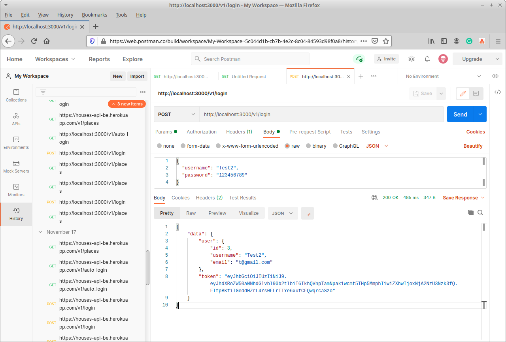
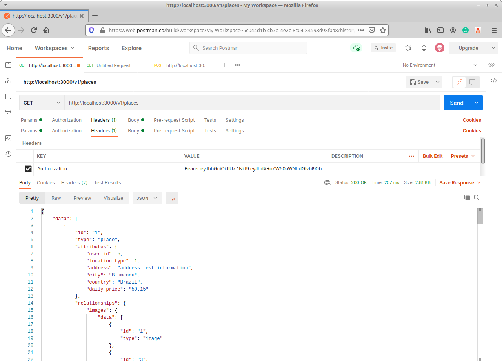

[![Contributors][contributors-shield]][contributors-url]
[![Forks][forks-shield]][forks-url]
[![Stargazers][stars-shield]][stars-url]
[![Issues][issues-shield]][issues-url]

# Rails API for rent a place

On this project, I created an API to get houses information for an App. The idea is to create a simplified version of AirBnb. For now, the API manages creating and signing users (utilizing tokens for validating the sessions/saving the machine login), each user can create, edit, and delete their own places. A table for the places and one for images, to link how many pictures you want on each place and favorite places for the users. The API has also prepared a table for creating and cancel reservations on places.

#### Example return login


#### Example return places


## Table of Contents

- [Installation](#installation)
- [API calls](#api-calls)
- [Tests](#tests)
- [Built With](#built-with)
- [Live Version](#live-version)
- [Future Implementations](#future-implementations)
- [Contributing](#contributing)
- [Acknowledgments](#acknowledgments)
- [Authors](#author)
- [License](#license)

## Installation

You can get a local copy of the repository please run the following commands on your terminal:

```
$ cd <folder>
$ git clone https://github.com/Stricks1/HousesApi.git
```

### Server Side

The API (server side) is on the folder server. In order to run the server go to the folder run `$ bundle install` to get install the gems needed. After that we need to migrate the db with `$ rails db:migrate`, and finally you can run the server using the command `$ rails server`.
You are ready to access the API on the address `http://localhost:3000/`
Alternatively you can use our already deployed version with an existing database [here](https://houses-api-be.herokuapp.com/)

#### Prerequisites for Running API

Ruby: >= 2.6.5 - Rails >=5.2.4.3

## API Calls

This API requires a login user to be accessible, so when the user is created or login, one JSON property returned is a token that needs to be used on the Header of any Authenticated calls for it to work. The token is also utilized to know what user is accessing the API in order to know if he have access for editing a place/favorite.
The following calls/actions are valid for the API (look the code for more information on detailed returned objects/accepted params):

### Non-authenticated calls:

| TYPE          | URL           | EXPECTED        |
| ------------- | ------------- | --------------- |
| POST          | /v1/users     | JSON (user info)|
| POST          | /v1/login     | JSON (user info)|

### Authenticated calls:

Every Authenticated call, requires a header named 
`Authorization`
with information `Bearer [token received on login]`

| TYPE          | URL                | EXPECTED                                          |
| ------------- | ------------------ | ------------------------------------------------- |
| GET           | /v1/auto_login     | JSON (user info)                                  |
| GET           | /v1/user_is_authed | Info if token is valid                            |
| GET           | /v1/logout         | Change valid token                                |
| GET           | /v1/places         | JSON (all places)                                 |
| POST          | /v1/places         | JSON (create place)                               |
| GET           | /v1/places/:id     | JSON (place info)                                 |
| PATCH         | /v1/places/:id     | JSON (updated place if user is owner)             |
| PUT           | /v1/places/:id     | JSON (updated place if user is owner)             |
| DELETE        | /v1/places/:id     | Remove place if user is owner                     |
| GET           | /v1/rent_dates/    | JSON (rent dates info for user)                   |
| POST          | /v1/rent_dates/:id | JSON (Create rent date for user)                  |
| DELETE        | /v1/rent_dates/:id | Remove the rent date for user/place               |
| POST          | /v1/images/:id     | JSON (Create image for place)                     |
| DELETE        | /v1/images/:id     | Remove the image from place                       |
| GET           | /v1/favorites/     | JSON (Favorite places for user)                   |
| POST          | /v1/favorites/     | Create favorite place for user                    |
| DELETE        | /v1/favorites/:id  | Remove the favorite place from user               |
| POST          | /v1/occupied/:id   | Get occupied dates from place between param dates |

## Tests

To RoR RSpec tests we have the following files:

```
rspec spec/controllers/auth_spec.rb
rspec spec/controllers/favorites_spec.rb
rspec spec/controllers/images_spec.rb
rspec spec/controllers/places_spec.rb
rspec spec/controllers/rent_dates_spec.rb
rspec spec/controllers/users_spec.rb
```

```
rspec spec/models/favorites_spec.rb
rspec spec/models/images_spec.rb
rspec spec/models/places_spec.rb
rspec spec/models/rent_dates_spec.rb
rspec spec/models/users_spec.rb
```


## Built With

- Ruby on Rails

### Test with

- Rspec
- Faker
- FactoryBot

## Live Version

[Deployed on Heroku](https://houses-api-be.herokuapp.com/)

## Future Implementations

- For future implementations, I consider creating a table for a chat between users so the owner and the renter can speak.

## Contributing

Contributions, issues and feature requests are welcome!

You can do it on [issues page](issues/).

## Acknowledgments

This project was inspired by this [behance project idea](https://www.behance.net/gallery/37706679/Circle-(Landing-page-Dashboard-Mobile-App)) by [Alexey Savitskiy](https://www.behance.net/alexey_savitskiy)

Special thanks to code reviewers.

## Show your support

Give a ⭐️ if you like this project!

## Author

👤 **Gabriel Malheiros Silveira**

- Github: [@Stricks1](https://github.com/Stricks1)
- Linkedin: [Gabriel Silveira](https://linkedin.com/in/gabriel-malheiros-silveira/)
- Twitter: [@Gabriel_Stricks](https://twitter.com/Gabriel_Stricks)

## License

<strong>Creative Commons 2020</strong>

<!-- MARKDOWN LINKS & IMAGES -->

[contributors-shield]: https://img.shields.io/github/contributors/stricks1/HousesApi.svg?style=flat-square
[contributors-url]: https://github.com/stricks1/HousesApi/graphs/contributors
[forks-shield]: https://img.shields.io/github/forks/stricks1/HousesApi.svg?style=flat-square
[forks-url]: https://github.com/stricks1/HousesApi/network/members
[stars-shield]: https://img.shields.io/github/stars/stricks1/HousesApi.svg?style=flat-square
[stars-url]: https://github.com/stricks1/HousesApi/stargazers
[issues-shield]: https://img.shields.io/github/issues/stricks1/HousesApi.svg?style=flat-square
[issues-url]: https://github.com/stricks1/HousesApi/issues
